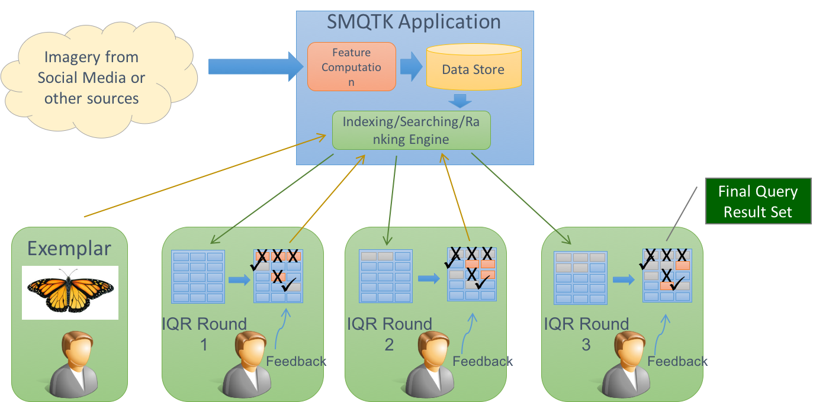
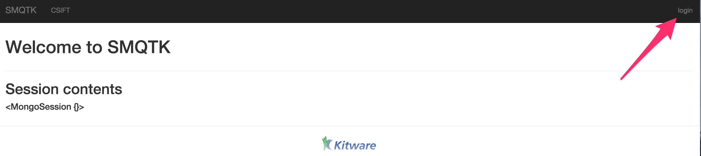
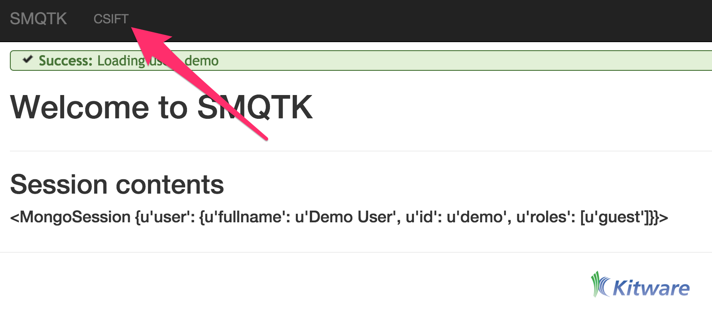
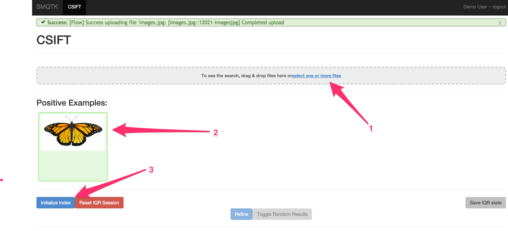
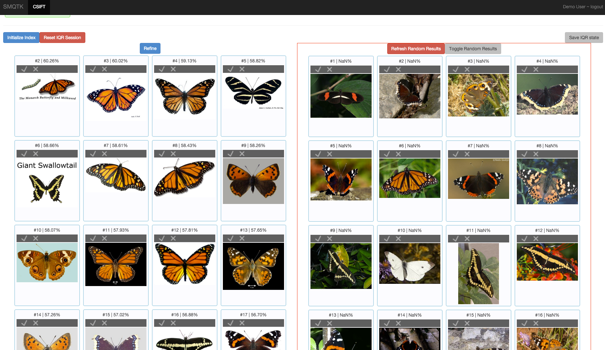
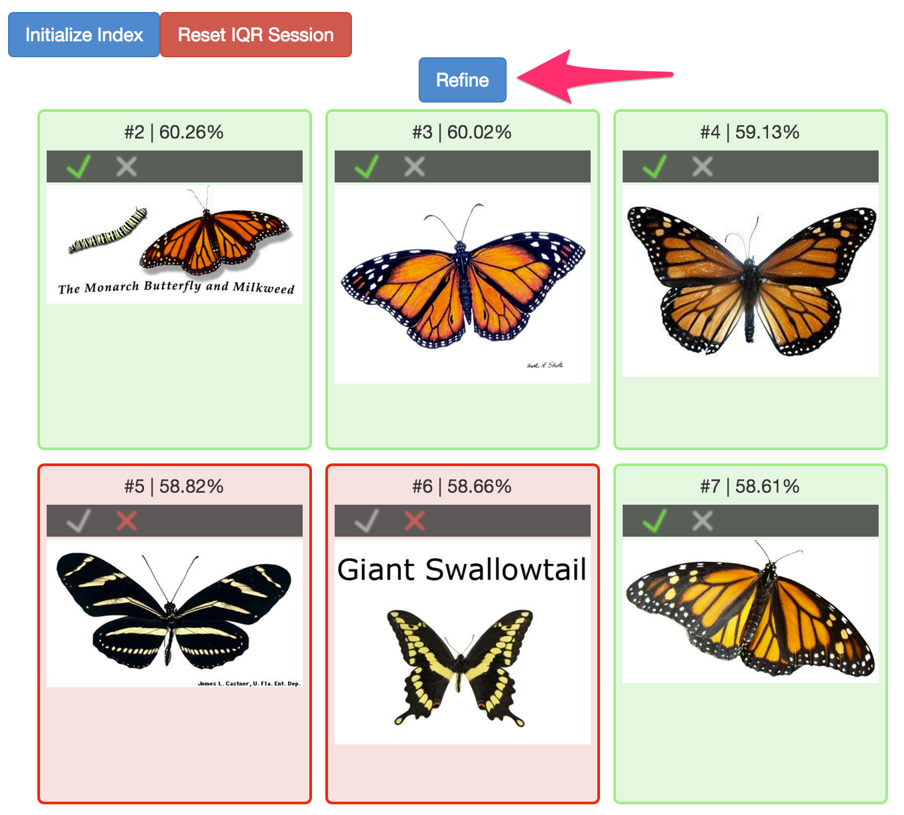

.. _iqrdemoapp:
IQR Demo Application
====================

Interactive Query Refinement or "IQR" is a process whereby a user
provides an examplar image or images and a system attempts to locate
additional images from an archive that a simimilar to the examplar(s).
The user then adjudicates the results by identifying those results
that match their search and those results.  The system then uses
those adjudications to attempt to provide better, more closely
matching results refined by the user's input.

.. _iqrsmqtk:

   **SMQTK IQR Workflow**

   *Overall workflow of an SMQTK based Interactive Query Refinement application.*

The IQR application is an excellent example application for SMQTK as it makes use of a broad spectrum of SMQTK's capabilities.
In order to characterize each image in the archive so that it can be indexed, the :ref:`DescriptorGenerator <descriptor_generator>` algorithm is used.
The :ref:`NearestNeighborsIndex <nearest_neighbors_index>` is used to understand the relationship between the images in the archive and the
:ref:`RelevancyIndex <relevancey_index>` is used to rank results based on the user's positive and negative ajudications.

SMQTK comes with a web based application that implements an IQR system using SMQTK's
services as shown in the :ref:`iqrsmqtk` figure.

Running the IQR Application
---------------------------

In order to run the IQR demonstration application, you will need an archive of imagery.  SMQTK has facilities for creating indexes that support
10's or even 100's or 1000's of thousands of images we'll be using simpler implementations for this example.  As a result, we'll use a modest archive
of images.   The `Leeds Butterfly Dataset`_ will serve quite nicely. Download and unzip the archive (which contains over 800 images of different species of butterflys).

.. _`Leeds Butterfly Dataset`: http://www.comp.leeds.ac.uk/scs6jwks/dataset/leedsbutterfly/

SQMTK comes witha script that computes the descriptors on all of the images in your archive, and bulids up the models needed by the Nearest Neighbors and Relevancy indices:

.. argparse::
   :ref: iqr_app_model_generation.cli_parser
   :prog: iqr_app_model_generation

The CONFIG argument specifies a JSON file that provides a configuration block for each of the SMQTK algorithms (DescriptorGenerator, NearestNeighborsIndex etcc) required to generate the
models and indices that will be required by the application.  For convenience, the sampe CONFIG file will be provided to the web application when it is run.

The SMQTK source repository contains a sample configuration file.   It can be found in ``source/python/smqtk/web/search_app/config.IqrSearchApp.json``.  The configuration is designed to run
run from an empty directory and will create the sub directories and files that it requires when run.

.. literalinclude:: /../python/smqtk/web/search_app/config.IqrSearchApp.json
   :language: json
   :emphasize-lines: 2,7,12,22,26,39,64,73,77
   :linenos:

Since this configuration file drives both the generation of the models for the application and the application itself,  a closer examination of it is in order.

As a JSON file, the configuration consists of a collection of JSON objects that are used to configure various aspects of the application.  Lines 2, 73 and 77 introduce blocks that configure the way
the application itself works: setting the username and password, the location of the MongoDB_ server that the application uses for storing session information and finally the IP address and port that
the application listens on.

The array of "tabs" that starts at line 7 is the core of the configuration file.  We'll talk in a moment about why this is an array of tabs but for now we'll examine the the single element in the array.
The blocks introduced at lines 26, 39, and 77 configure the three main algorithms used by the application:  the descriptor used, the nearest neighbors index, and the relevancy index.
Each of these of these blocks is passed to the SMQTK plugin system to create the appropriate instance of the algorithm in question.
For example the ``nn_index`` block that starts at line 39 defines the the parameters for two different implementations, an ``LSHNearestNeighborIndex``, configured to use Iterative Quantization (paper_), to generate an index and ``FlannNearestNeighborsIndex`` which uses the Flann_ library to do so.
The ``type`` element on line 75 selects ``FlannNearestNeighborsIndex`` to be active for this configuration.

.. _MongoDB: http://www.mongodb.org
.. _paper: http://www.cs.unc.edu/~lazebnik/publications/cvpr11_small_code.pdf
.. _Flann: http://www.cs.ubc.ca/research/flann/

Once you have the configuration file set up the way that you like it, you can generate all of the models and indexes required by the application by running the following command::

    iqr_app_model_generation -c config.IqrSearchApp.json /path/to/leeds/data/images/*.jpg

This will generate descriptors for all of the images in the data set and use them to compute the models and indices it requires.

Once it completes, you can run the ``IqrSearchApp`` itself.  You'll need an instance of MongoDB running on the port and IP address specified by the ``mongo`` element on line 73.  You can start a Mongo
instance (presuming you have it installed) with::

    mongod --dbpath /path/to/mongo/work/dir

Once Mongo has been started you can start the ``IqrSearchApp`` with the following command::

    runApplication.py -a IqrSearchApp -c config.IqrSearchApp.json

When the application starts you should click on the ``login`` element and then enter the credentials you specified in the ``flask_app`` element of the config file.

   *Click on the login element to enter your credentials*

Once you've logged in you will be able to select the ``CSIFT`` tab of the UI.  This tab was named by line 9 in the configuration file and is configure by the first block in the ``tabs``
array.  The ``tabs`` array allows you to configure different combinations of the required algorithms within the same application instance -- useful for example, if you want to compare the
performance of different descriptors.

   *Select the CSIFT tab to begin working with the application*

To begin the IQR process drag an exemplar image to the grey load area (marked ``1`` in the next figure).  In this case we've uploaded a picture of a Monarch butterfly (Item 2).  Once
you've done so, click the ``Refine`` element (Item 3) and the system will return a set of images that it believes are similar to the exemplar image based on the descriptor computed.

   *IQR Initilization*

The next figure shows the set of images returned by the system (on the left) and a random selection of images from the archive (by clicking the ``Toggle Random Results`` element).  As you can
see, even with just one exemplar the system is beginning to learn to return Monarch butterflys (or butterflys that look like Monarchs)

   *Initial Query Results and Random Results*

At this point you can begin to refine the query.  You do this by marking correct returns at their checkbox and incorrect returns at the "X".  Once you've marked a number of
returns, you can select the "Refine" element which will use your adjudications to retrain and rerank the results with the goal that you will increasingly see correct results in
your result set.

   *Query Refinement*

You can continue this process for as long as you like until you are satisfied with the results that the query is returning.   Once you are happy with the reulsts, you can select the ``Save IQR State``
element.  This will save a file that contains all of the information requires to use the results of the IQR query as an image classifier. The process for doing this is described in the next session.

Using and IQR Trained Classifier
--------------------------------

Before you can use your IQR session as a classifier, you must first train the classifier.  You can do this with the ``iqrTrainClassifier`` command:

.. argparse::
   :ref: iqrTrainClassifier.get_cli_parser
   :prog: iqrTrainClassifier

As with other commands from SMQTK the config file is a set of configuration blocks stored in a JSON file.  An example ships in the SMQTK repository:

.. literalinclude:: /../python/smqtk/web/search_app/config.iqrTrainClassifier.json
   :language: json
   :linenos:

In this case the only block required, specifies the classifier that will be used, in this case the ``LibSvmClassifier``.  We'll assume that you downloaded your IQR session as
``1d62a3bb-0b74-479f-be1b-acf03cabf944.IqrState``.  In that case the following command will train your classifier leveraging the descriptors associated with the IQR session that you saved.::

    iqrTrainClassifier.py -c config.iqrTrainClassifier.json -i 1d62a3bb-0b74-479f-be1b-acf03cabf944.IqrState

Once you have trained the classifier, you can use the ``classifyFiles`` command to actually classify a set of files.

.. argparse::
   :ref: classifyFiles.get_cli_parser
   :prog: classifyFiles

Again, we need to provide a config block based configuration file for the command.  As with ``iqrTrainClassifier``, there is a sample configuration file in the repository:

.. literalinclude:: /../python/smqtk/web/search_app/config.classifyFiles.json
   :language: json
   :linenos:

Note that the ``classifier`` block on line 10 is the same as the ``classifier`` block in the ``iqrTrainClassfier`` configuration file.  Further, the ``descriptor_generator`` block on line 42
matches the descriptor generator used for the IQR application itself (thus matching the type of descriptor used to train the classifier).

Once you've set up the configuration file to yoru liking, you can classify a set of labels with the following command::

    classifyFiles.py -c config.classifyFiles.json -l positive /path/to/leedsbutterfly/images/*.jpg

If you leave the ``-l`` argument, the command will tell you the labels available with the classifier (in this case *positive* and *negative*).

SMQTK's ``classifyFiles`` command can use this saved
IQR state to classify a set of files (not necessarily the files in your IQR Applicaiton ingest).  The command has the following form:
