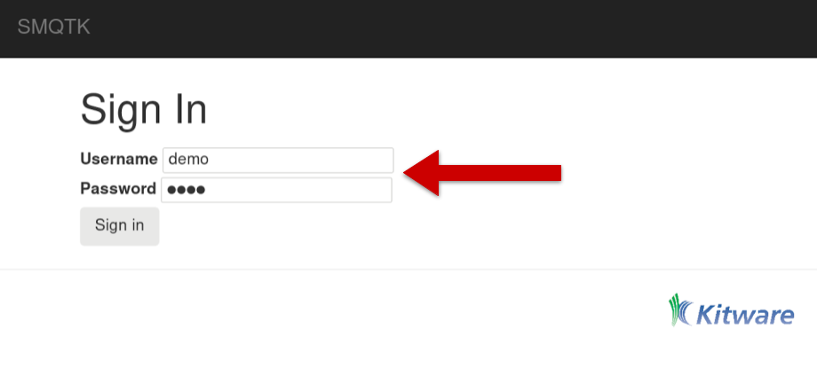
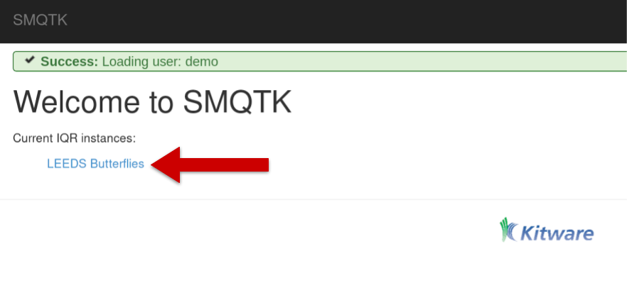

.. _iqrdemoapp:

IQR Demo Application
====================

Interactive Query Refinement or "IQR" is a process whereby a user provides one or more exemplar images and the system attempts to locate additional images from within an archive that a similar to the exemplar(s).
The user then adjudicates the results by identifying those results that match their search and those results that do not.
The system then uses those adjudications to attempt to provide better, more closely matching results refined by the user's input.

.. _iqrsmqtk:

.. figure:: figures/IQRWithSMQTK.png
   :align: center

   **SMQTK IQR Workflow**

   *Overall workflow of an SMQTK based Interactive Query Refinement
   application.*

The IQR application is an excellent example application for SMQTK as it makes use of a broad spectrum of SMQTK's capabilities.
In order to characterize each image in the archive so that it can be indexed, the :class:`.DescriptorGenerator` algorithm is used.
A :class:`.NearestNeighborsIndex` algorithm is used to understand the relationship between the images in the archive and a :class:`.RelevancyIndex` algorithm is used to rank results based on the user's positive and negative adjudications.

SMQTK comes with a pair of web-based application that implements an IQR system using SMQTK's services as shown in the :ref:`iqrsmqtk` figure.

Running the IQR Application
---------------------------
The SMQTK IQR demonstration application consists of two web services: one for hosting the models and processing for an archive, and a second for providing a user-interface to one or more archives.

In order to run the IQR demonstration application, we will need an archive of imagery.
SMQTK has facilities for creating indexes that support 10's or even 100's or 1000's of images.
For demonstration purposes, we'll use a modest archive of images.
The `Leeds Butterfly Dataset`_ will serve quite nicely.
Download and unzip the archive (which contains over 800 images of different species of butterflies).

.. _`Leeds Butterfly Dataset`: http://www.comp.leeds.ac.uk/scs6jwks/dataset/leedsbutterfly/

SMQTK comes with a script, :py:mod:`~smqtk.bin.iqr_app_model_generation`, that computes the descriptors on all of the images in your archive and builds up the models needed by the :class:`.NearestNeighborsIndex` and :class:`.RelevancyIndex` algorithms.

.. argparse::
   :ref: smqtk.bin.iqr_app_model_generation.cli_parser
   :prog: iqr_app_model_generation
   :nodescription:
   :noepilog:

The ``-c/--config`` option should be given the 2 paths to the configuration files for the :class:`.IqrSearchDispatcher` and :class:`.IqrService` web services respectively.
These provide the configuration blocks for each of the SMQTK algorithms (:class:`.DescriptorGenerator`, :class:`.NearestNeighborIndex`, etc.) required to generate the models and indices that will be required by the application.
For convenience, the same configuration files will be provided to the web applications when they are run later.

The SMQTK source repository contains sample configuration files for both the :class:`.IqrSearchDispatcher` and :class:`.IqrService` services.
They can be found at :download:`source/python/smqtk/web/search_app/sample_configs/config.IqrSearchApp.json </../python/smqtk/web/search_app/sample_configs/config.IqrSearchApp.json>` and :download:`source/python/smqtk/web/search_app/sample_configs/config.IqrRestService.json </../python/smqtk/web/search_app/sample_configs/config.IqrRestService.json>` respectively.
The :py:mod:`.iqr_app_model_generation` script is designed to run from an empty directory and will create the sub-directories specified in the above configurations requires when run.

Since these configuration files drive both the generation of the models and the web applications themselves, a closer examination is in order.

Present in both configuration files are the ``flask_app`` and ``server`` sections which control Flask web server application parameters.
The :file:`config.IqrSearchApp.json` contains the additional section ``mongo`` that configures the MongoDB_ server the UI service uses for storing user session information.

.. _MongoDB: http://www.mongodb.org

.. literalinclude:: /../python/smqtk/web/search_app/sample_configs/config.IqrSearchApp.json
   :language: json
   :linenos:
   :emphasize-lines: 15,18,32

The :file:`config.IqrSerchApp.json` configuration has an additional block "iqr_tabs" (line 15).
This defines the different archives, and matching IQR REST service describing that archive, the UI is to provide an interface for.
In our case there will be only one entry, "LEEDS Butterflies" (line 16), representing the archive that we are currently building.
This section describes the data-set container that contains the archive imagery to show in the UI (line 18) as well as the URL to the RESTful service providing the IQR functions for the archive (line 32).

In the :file:`config.IqrRestService.json` configuration file (shown below) we see the specification of the algorithm and representation plugins the RESTful IQR service app will use under ``iqr_service -> plugins``.
Each of these of these blocks is passed to the SMQTK plugin system to create the appropriate instances of the algorithm or data representation in question.
The blocks located at lines 35, 66, and 147 configure the three main algorithms used by the application:  the descriptor generator, the nearest neighbors index, and the relevancy index.
For example the ``nn_index`` block that starts at line 66 specifies two different implementations: :py:class:`.FlannNearestNeighborsIndex`, which uses the Flann_ library, and :py:class:`.LSHNearestNeighborIndex`, configured to use the Iterative Quantization hash function (`paper`_).
The ``type`` element on line 135 selects the :py:class:`.LSHNearestNeighborIndex` to be used for this configuration.

.. _paper: http://www.cs.unc.edu/~lazebnik/publications/cvpr11_small_code.pdf
.. _Flann: http://www.cs.ubc.ca/research/flann/

:ref:`(jump past configuration display) <post_iqr_rest_conf>`

.. literalinclude:: /../python/smqtk/web/search_app/sample_configs/config.IqrRestService.json
   :language: json
   :linenos:
   :emphasize-lines: 35,66,135,147

.. _post_iqr_rest_conf:

Once you have the configuration file set up the way that you like it, you can generate all of the models and indexes required by the application by running the following command::

    iqr_app_model_generation \
        -c config.IqrSearchApp.json config.IqrRestService.json \
        -t "LEEDS Butterflies" /path/to/butterfly/images/*.jpg

This will generate descriptors for all of the images in the data set and use them to compute the models and indices we configured, outputting to the files under the ``workdir`` directory in your current directory.

Once it completes, you can run the ``IqrSearchApp`` and ``IqrService`` web-apps.
You'll need an instance of MongoDB running on the port and host address specified by the ``mongo`` element on line 13 in your ``config.IqrSearchApp.json`` configuration file.
You can start a Mongo instance (presuming you have it installed) with::

    mongod --dbpath /path/to/mongo/data/dir

Once Mongo has been started you can start the ``IqrSearchApp`` and ``IqrService`` services with the following commands in separate terminals::

   # Terminal 1
   runApplication -a IqrService -c config.IqrRestService.json

   # Terminal 2
   runApplication -a IqrSearchDispatcher -c config.IqrSearchApp.json

After the services have been started, open a web browser and navigate to ``http://localhost:5000``.
Click lick on the ``login`` button in the upper-right and then enter the credentials specified in the default login settings file :file:`source/python/smqtk/web/search_app/modules/login/users.json`.

.. figure:: figures/iqrlogin.png
   :align: center

   *Click on the login element to enter your credentials*

   *Enter demo credentials*

Once you've logged in you will be able to select the ``LEEDS Butterfly`` link.
This link was named by line 16 in the :file:`config.IqrSearchApp.json` configuration file.
The ``iqr_tabs`` mapping allows you to configure interfacing with different IQR REST services providing different combinations of the required algorithms -- useful for example, if you want to compare the performance of different descriptors or nearest-neighbor index algorithms.

   *Select the "LEEDS Butterflies" link to begin working with the application*

To begin the IQR process drag an exemplar image to the grey load area (marked ``1`` in the next figure).
In this case we've uploaded a picture of a Monarch butterfly (``2``).
Once uploaded, click the ``Initialize Index`` button (``3``) and the system will return a set of images that it believes are similar to the exemplar image based on the descriptor computed.

.. figure:: figures/iqrinitialize.png
   :align: center

   *IQR Initilization*

The next figure shows the set of images returned by the system (on the left) and a random selection of images from the archive (by clicking the ``Toggle Random Results`` element).
As you can see, even with just one exemplar the system is beginning to learn to return Monarch butterflies (or butterflies that look like Monarchs)

.. figure:: figures/iqrinitialresults.png
   :align: center

   *Initial Query Results and Random Results*

At this point you can begin to refine the query.  You do this by marking correct returns at their checkbox and incorrect returns at the "X".  Once you've marked a number of
returns, you can select the "Refine" element which will use your adjudications to retrain and rerank the results with the goal that you will increasingly see correct results in
your result set.

.. figure:: figures/iqrrefine.png
   :align: center

   *Query Refinement*

You can continue this process for as long as you like until you are satisfied with the results that the query is returning.
Once you are happy with the results, you can select the ``Save IQR State`` button.
This will save a file that contains all of the information requires to use the results of the IQR query as an image classifier. The process for doing this is described in the next session.

Using an IQR Trained Classifier
-------------------------------

Before you can use your IQR session as a classifier, you must first train the classifier model from the IQR session state.
You can do this with the ``iqrTrainClassifier`` tool:

.. argparse::
   :ref: smqtk.bin.iqrTrainClassifier.get_cli_parser
   :prog: iqrTrainClassifier
   :nodescription:
   :noepilog:

As with other tools from SMQTK the configuration file is a JSON file.
An default configuration file may be generated by calling ``iqrTrainClassifier -g example.json``, but pre-configured example file can be found :download:`here </../python/smqtk/web/search_app/sample_configs/config.iqrTrainClassifier.json>` and is shown below:

.. literalinclude:: /../python/smqtk/web/search_app/sample_configs/config.iqrTrainClassifier.json
   :language: json
   :linenos:

The above configuration specifies the classifier that will be used, in this case the ``LibSvmClassifier``.
Let us assume the IQR session state was downloaded as ``monarch.IqrState``.
The following command will train a classifier leveraging the descriptors labeled by the IQR session that was saved::

    iqrTrainClassifier.py -c config.iqrTrainClassifier.json -i monarch.IqrState

Once you have trained the classifier, you can use the ``classifyFiles`` command to actually classify a set of files.

.. argparse::
   :ref: smqtk.bin.classifyFiles.get_cli_parser
   :prog: smqtk-classify-files
   :nodescription:
   :noepilog:

Again, we need to provide a JSON configuration file for the command.
As with ``iqrTrainClassifier``, there is a sample configuration file in the repository:

.. literalinclude:: /../python/smqtk/web/search_app/sample_configs/config.classifyFiles.json
   :language: json
   :linenos:
   :emphasize-lines: 7-18,25-39

Note that the ``classifier`` block on lines 7-18 is the same as the ``classifier`` block in the ``iqrTrainClassfier`` configuration file.
Further, the ``descriptor_generator`` block on lines 25-39 matches the descriptor generator used for the IQR application itself (thus matching the type of descriptor used to train the classifier).

Once you've set up the configuration file to your liking, you can classify a set of labels with the following command::

    smqtk-classify-files -c config.classifyFiles.json -l positive /path/to/butterfly/images/*.jpg

If you leave the ``-l`` argument, the command will tell you the labels available with the classifier (in this case *positive* and *negative*).

SMQTK's ``smqtk-classify-files`` tool can use this saved
IQR state to classify a set of files (not necessarily the files in your IQR Applicaiton ingest).  The command has the following form:
